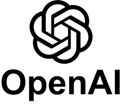
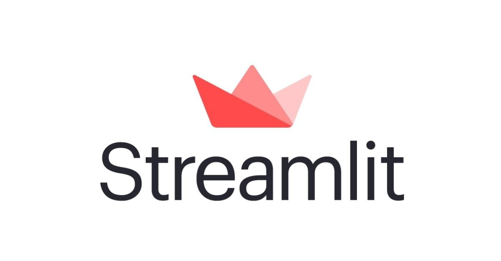

# AI Interview Chatbot
## Table of Content

- Overview
- Technical Aspect
- Installation
- Troubleshooting
- Directory Tree
- Bug / Feature Request
- Technologies Used

## Overview
This project is an Interview Chatbot created using OpenAI's GPT-3.5 and the Streamlit framework. The chatbot generates job-specific interview questions and evaluates the candidate's responses. This is achieved using a sequence of prompts that leverage the language model's capabilities in creating questions and evaluating responses.


https://github.com/nehalvaghasiya/interview-bot/assets/78668871/514c7ac2-c2e8-4e60-a4f4-2dd76bd30edd


## Technical Aspect
The Interview Chatbot project is primarily divided into two parts:

1. The generation of job-specific interview questions.
2. Evaluation of the candidate's responses to the questions.

Both tasks are accomplished using OpenAI's GPT-3.5 language model. The project uses Streamlit to create a simple and user-friendly web interface for the chatbot.

## Installation

The installation steps are different for different OS.

### Linux:

```bash
python3.8 --version
apt install python3.8-venv
python3 -m venv myenv
source myenv/bin/activate
pip install -r requirements.txt
export OPENAI_API_KEY=<your secret key>
streamlit run chatbot.py
```

### Windows:

```bash
python3.8 -m venv myenv
myenv\Scripts\activate
pip install -r requirements.txt
export OPENAI_API_KEY=<your secret key>
streamlit run chatbot.py
```

### Mac:

```bash
python3.8 -m venv myenv
source myenv/bin/activate
pip install -r requirements.txt
export OPENAI_API_KEY=<your secret key>
streamlit run chatbot.py
```

Remember to replace `<your secret key>` with your actual OpenAI API Key.


## Troubleshooting

If you encounter errors while installing the dependencies from `requirements.txt`, try installing the packages individually using the following commands:

```bash
pip install openai
pip install streamlit
pip install streamlit-chat
```

Then, export your OpenAI API Key and run the chatbot:
```bash
export OPENAI_API_KEY=<your secret key>
streamlit run chatbot.py
```
Remember to replace `<your secret key>` with your actual OpenAI API Key.


## Directory Tree
```
├── images
│   ├── openai.png
│   ├── streamlit.jpg
├── .gitignore
├── chatbot.py
├── config.py
├── utils.py
├── requirements.txt
└── README.md
```

## Bug / Feature Request
If you find a bug (the website couldn't handle the query and / or gave undesired results), kindly open an issue [here](https://github.com/nehalvaghasiya/interview-bot/issues/new) by including your search query and the expected result.

If you'd like to request a new function, feel free to do so by opening an issue [here](https://github.com/nehalvaghasiya/interview-bot/issues/new). Please include sample queries and their corresponding results.

## Technologies Used

 
